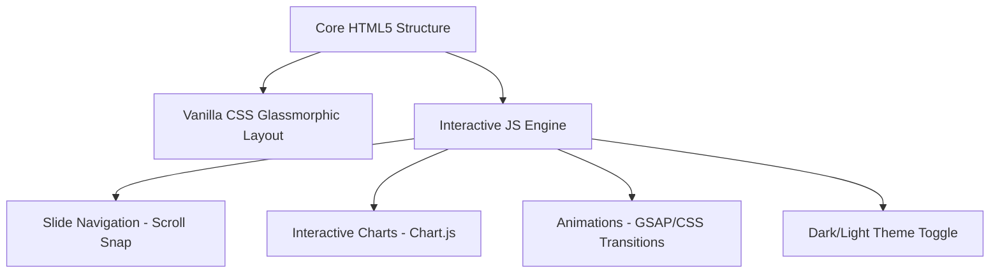

# 📊 발표 슬라이드 제작 계획서 (Presentation Slide Deck Plan)

본 계획서는 @[리바이스 미래 성장 및 비즈니스 혁신 전략 보고서 (2025-2027)](file:///Users/minji/Documents/final2/data/%E1%84%85%E1%85%B5%E1%84%87%E1%85%A1%E1%84%8B%E1%85%B5%E1%84%89%E1%85%B3%20%E1%84%86%E1%85%B5%E1%84%85%E1%85%A2%20%E1%84%89%E1%85%A5%E1%86%BC%E1%84%8C%E1%85%A1%E1%86%BC%20%E1%84%86%E1%85%B5%E1%86%BE%20%E1%84%87%E1%85%B5%E1%84%8C%E1%85%B3%E1%84%82%E1%85%B5%E1%84%89%E1%85%B3%20%E1%84%92%E1%85%A7%E1%86%A8%E1%84%89%E1%85%B5%E1%86%AB%20%E1%84%8C%E1%85%A5%E1%86%AB%E1%84%85%E1%85%A3%E1%86%A8%20%E1%84%87%E1%85%A9%E1%84%80%E1%85%A9%E1%84%89%E1%85%A5%20%282025-2027%29.md) 데이터를 바탕으로, 청중을 사로잡을 수 있는 프리미엄 발표 슬라이드를 구성하기 위해 작성되었습니다.

사용자 피드백("리바이스는 올드하고 디자인이 안 예쁘다")을 적극적으로 반영하여, 기존의 고착화된 브랜드 이미지를 타파하고 **트렌디하고 감각적인 비주얼 중심의 슬라이드**를 기획했습니다.

---

## 1. 발표 자료 제작 방향 (Concept & Vision)

*   **더블 테마 전략 (Double-Theme Strategy)**
    *   **Part 1 (리바이스)**: **"Heritage meets Future"**
        *   올드한 이미지를 탈피하기 위해 차가운 데님 인디고 블루(Deep Indigo)와 형광 네온 컬러(Neon Accent)를 매치하여 미래지향적이고 힙한 감성 연출.
    *   **Part 2 (게스코리아)**: **"Next-Gen Digital Play"**
        *   게스의 시그니처 레드(Sleek Red)와 세련된 다크 그레이(Charcoal), 글래스모피즘(Glassmorphism) 효과를 결합하여 프리미엄 테크 이커머스 감성 전달.
*   **비주얼 퍼스트 (Visual-First Layout)**
    *   텍스트를 최소화하고, 핵심 지표(객단가 +25%, 멤버십 4,500만 명, 5만 원 임계값)를 대형 타이포그래피와 미니멀한 차트로 시각화.
    *   아이콘, 다이어그램, 모노톤 배경의 대비를 활용하여 프리미엄 매거진을 보는 듯한 고품격 레이아웃 적용.
*   **사용자 피드백 반영 슬라이드 추가**
    *   리바이스 파트에 **"디자인 혁신 및 브랜드 이미지 다각화(Re-Branding)"** 내용을 보완하여 트렌디한 감각 제안.

---

## 2. 디자인 시스템 (Design System)

### 🎨 Color Palette
*   **Levi's Indigo Cyber (리바이스 테마)**
    *   배경: `#0D1117` (Deep Dark) / `#FFFFFF` (Clean Light)
    *   주조색: `#1E3A8A` (Deep Indigo Blue)
    *   보조색: `#10B981` (Cyber Mint) 또는 `#F43F5E` (Neo Rose)
*   **Guess Red Velvet (게스 테마)**
    *   배경: `#121212` (Premium Matte Black) / `#F9FAFB` (Soft White)
    *   주조색: `#E11D48` (Guess Signature Red)
    *   보조색: `#4B5563` (Slate Gray)

### ✍️ Typography & Icons
*   **영문 헤더**: `Outfit` 또는 `Syne` (트렌디하고 기하학적인 프리미엄 폰트)
*   **한글 본문**: `Pretendard` 또는 `Noto Sans KR` (가독성이 극대화된 샌스세리프)
*   **아이콘**: `Lucide Icons` 또는 `Phosphor Icons` (미니멀하고 얇은 라인 스타일)

---

## 3. 슬라이드 상세 구성안 (Slide Outline)

### 👖 PART 1: 리바이스 미래 성장 및 비즈니스 혁신 전략 (2025-2027)

#### **Slide 1: 타이틀 (Heritage Meets Future)**
*   **타이틀**: 리바이스 2025-2027: 데이터 기반 프리미엄 라이프스타일 테크 기업으로의 진화
*   **비주얼**: 어두운 인디고 데님 텍스처 배경 + 네온 컬러의 라인 아트 그래픽.
*   **핵심 키워드**: DTC, Portfolio Diversification, AI Integration, ESG

#### **Slide 2: 현주소 진단 (Pain Points & Diagnostics)**
*   **타이틀**: 유통의 종속성과 한계를 마주하다
*   **내용**:
    *   *도매 종속*: 백화점/멀티숍 위주 유통으로 고객 데이터(First-party) 확보 불가 및 마진 제한
    *   *단일 카테고리*: 하의(데님 팬츠)에 편중되어 패스트패션/애슬레저 공세에 취약
    *   *재고 부담*: 수요 예측 오차로 인한 할인율 상승 및 브랜드 가치 하락
*   **비주얼**: 3개의 메탈릭 그레이 카드로 구성된 챌린지 영역 시각화.

#### **Slide 3: 성장의 도화선 (Key Opportunity Facts)**
*   **타이틀**: 우리가 보유한 강력한 엔진들
*   **내용**:
    *   **헤리티지 자산**: 170년 정통의 'Levi's 501®' 브랜드 파워
    *   **NextGen 매장**: 디지털 맞춤형 매장 도입으로 **객단가 평균 25% 상승**
    *   **데이터 자산**: 전 세계 **4,500만 명** 규모의 강력한 로열티 멤버십 고객군
*   **비주얼**: `+25%`, `4,500만` 숫자를 강조한 볼드한 인포그래픽 카드.

#### **Slide 4: 핵심 전략 (4 Core Strategies)**
*   **타이틀**: 비즈니스를 혁신할 4대 필러 (Core Pillars)
*   **내용** (4분할 그리드 레이아웃):
    1.  **DTC 가속화 & 매장 혁신**: 테일러숍 확대, 2027년까지 DTC 비중 **55% 이상** 달성
    2.  **Head-to-Toe 포트폴리오**: 상의 비중 25% 확보, Beyond Yoga 협업, LVC 등 프리미엄 라인 강화
    3.  **디지털 & AI 전환**: SKU 단위 실시간 재고 관리(재고 7% 감축), AR 가상 피팅 도입
    4.  **근본적 지속가능성**: Water<Less™ 친환경 공정 80% 적용, 글로벌 세컨드핸드(순환 경제) 도입
*   **비주얼**: 2x2 반응형 카드 그리드 + 호버 액션 가이드.

#### **Slide 5: [★사용자 피드백 보완] 올드한 이미지의 탈피: Brand Modernization**
*   **타이틀**: "Is Levi's Old?" - 디자인 혁신과 핏 다각화
*   **내용**:
    *   **트렌디 디자인 & 콜라보**: 젊은 세대가 열광하는 글로벌 스트리트 브랜드와의 협업 정례화
    *   **실루엣의 다변화**: 전형적인 일자핏을 넘어 힙한 벌룬 핏, 오버사이즈 와이드, 여성용 하이라이즈 핏 세분화
    *   **디지털 핏 어드바이저**: 가상 피팅 및 스타일 매칭 AI를 활용해 트렌디한 코디 제안
*   **비주얼**: 클래식 데님 핏과 모던 스트리트 핏의 대비를 보여주는 트렌디한 분할 레이아웃.

#### **Slide 6: 경쟁 우위 분석 (Competitive Matrix)**
*   **타이틀**: 리바이스의 독보적인 포지셔닝
*   **내용**:
    *   브랜드 헤리티지 / 제품 내구성 / DTC 역량 / 지속가능성 지표 비교 (리바이스 vs 프리미엄 A vs 매스 SPA)
*   **비주얼**: 은은한 반투명(Glassmorphism) 스타일의 비교 표. 리바이스 영역 강조(하이라이트).

#### **Slide 7: 로드맵 (Strategic Roadmap)**
*   **타이틀**: 2025 - 2027 실행 타임라인
*   **내용**:
    *   *2025 (기반)*: DTC 55% 인프라 구축 & 로열티 데이터 통합
    *   *2026 (도약)*: NextGen 매장 100개 오픈 & AI 수요 예측 가동
    *   *2027 (안정)*: Head-to-Toe 정착, 영업이익률 15% 달성
*   **비주얼**: 가로형 네온 컬러의 타임라인 웹 인터랙션.

---

### 🔺 PART 2: 게스코리아 디지털 채널 혁신 전략 (2026-2028)

#### **Slide 8: 타이틀 (Next-Gen Digital Play)**
*   **타이틀**: 한국 패션 이커머스 격변기 속 GUESS의 디지털 채널 혁신 전략 (2026-2028)
*   **비주얼**: 매트 블랙 배경 + 게스 시그니처 레드 포인트 네온 라인.

#### **Slide 9: 시장 상황 (Korean E-commerce Market Transition)**
*   **타이틀**: 86조 한국 패션 시장, 저성장 뉴노멀의 시작
*   **내용**:
    *   2025 소매판매액 약 86조 원(성장률 0.8% 정체)
    *   불황형 가치 소비 트렌드의 고착화
    *   월간/시즌별 기획을 무너뜨리는 기후 위기(여름 장기화, 가을 지연)
*   **비주얼**: 하락/정체 추세를 직관적으로 보여주는 꺾은선 미니 그래프.

#### **Slide 10: 5대 핵심 변화 (5 Key Industry Trends)**
*   **타이틀**: 시장 판도를 바꾸는 5가지 거대한 물결
*   **내용**:
    1.  저성장 장기화 & 기후 적응형 상품 체계
    2.  플랫폼 수수료 피로감 & **5만 원 임계값** 기반 D2C 회귀
    3.  모바일 비디오 커머스 & 4050 숏폼 구매 확장
    4.  자율형 AI 쇼핑 에이전트의 출현
    5.  Z세대의 '편집된 자아' 가치 소비 & 미성년자 SNS 규제 장벽
*   **비주얼**: 5단계 가로형 카드 플로우.

#### **Slide 11: 유기적 채널 역학관계 (Channel Dynamics)**
*   **타이틀**: 플랫폼, 자사몰, 콘텐츠의 삼각 편대
*   **내용**:
    *   *플랫폼*: 신규 유저 유입 창구 (대형 트래픽)
    *   *자사몰(D2C)*: 5만 원 이상 고단가 진성 고객 락인 및 고마진 판매처
    *   *콘텐츠*: 숏폼/라이브 기반의 고객 체류 시간 통제 및 ROI 향상 (ROI 1.7배 상승, CAC 38% 절감)
*   **비주얼**: 플랫폼, 자사몰, 콘텐츠가 선순환하는 3각 플로우 차트.

#### **Slide 12: 전략 1: 5만 원 임계값 기반 D2C 스마트 물류**
*   **타이틀**: 고마진 자사몰 강화를 위한 스마트 물류 체인 구축
*   **내용**:
    *   *한섬 'Smart Hub e-Biz' 벤치마킹*: 오배송율 80% 감소, 배송/반품 편의성 극대화
    *   *D2C 인프라 격상*: 카페24 호스팅 고도화 + 실시간 재고 트래킹 연동
    *   *온라인 단독 아이템*: 133개 이상의 자사몰 독점 기획 상품 매칭
*   **비주얼**: 자동 물류 창고 이미지와 스마트폰 주문 화면의 입체적 대비 일러스트.

#### **Slide 13: 전략 2: SNS 규제 극복을 위한 ROPO & 패밀리 마케팅**
*   **타이틀**: 글로벌 미성년자 SNS 광고 규제 장벽을 넘다
*   **내용**:
    *   *장벽*: 미성년자 알고리즘 타깃 광고 규제 본격화
    *   *대안*: **ROPO(Research Online, Purchase Offline)** 옴니채널 마케팅
    *   *실행*: 부모 세대와 자녀 세대가 함께 즐기는 가족 중심 라이프스타일 룩북 강화 -> 온라인 탐색 후 프리미엄 매장(광주 충장로, 타임빌라스 등) 내 스마트 가상 피팅 예약 유도
*   **비주얼**: 스마트폰 화면(온라인 탐색)과 실제 매장 거울(오프라인 피팅)을 연결하는 인터랙티브 다이어그램.

#### **Slide 14: 전략 3: 본사 내재화 비디오 커머스 & 숏폼 퍼널**
*   **타이틀**: MD·디자이너 주도 정례 라이브 & 숏폼 재생산
*   **내용**:
    *   *내재화*: 외부 쇼호스트 의존 탈피, 상품을 가장 잘 아는 본사 전문가가 정기 라이브 진행 (구매전환율 극대화)
    *   *비디오 퍼널*: 라이브 영상을 쪼개어 '상세 페이지 핏 가이드 숏폼' 및 '소셜 리타겟팅 광고 소재'로 재가공 (타사 전환율 2.8배 상승 사례 적용)
*   **비주얼**: 모바일 세로형 라이브 화면 프레임과 숏폼 편집 과정을 시각화한 모션 그래픽.

#### **Slide 15: 전략 4: AI 비주얼 소셜 리스닝 R&D**
*   **타이틀**: 텍스트 너머의 고객 행동을 포착하는 컴퓨터 비전 기술
*   **내용**:
    *   *한계 극복*: 텍스트 해시태그 없이 영상 속 로고/의류만 노출되는 대다수의 소셜 언급 분석
    *   *ESOV(초과 음성 점유율) 측정*: 경쟁사 대비 브랜드 가시성 실시간 분석(ESOV 10%p 초과 시 시장점유율 0.5% 상승)
    *   *기후 대응 연계*: 피드백 데이터 수집 -> 여름/봄 시즌 기온에 맞춘 초경량 에어 데님 개발 및 즉시 유통
*   **비주얼**: AI 카메라 스캔 박스가 숏폼 영상 내 게스 로고를 감지하는 듯한 가상 인터페이스 뷰.

---

## 4. 웹 기반 프리미엄 슬라이드 구현 계획 (Web Implementation Plan)

발표 슬라이드를 일반적인 PDF/PPT를 넘어 **최신 트렌드 웹 기술을 도입한 인터랙티브 웹 데이션(Web-presentation)** 앱으로 개발할 수 있는 스택 제안입니다.

### 🛠️ 핵심 스택 및 기능
1.  **Core & Structure**: Vanilla HTML, CSS, JavaScript (외부 종속성이 최소화되어 매우 가볍고 빠름)
2.  **Navigation**: `CSS Scroll Snap` 또는 키보드 단축키/스크린 탭 인터랙션을 활용한 매끄러운 화면 슬라이드 전환.
3.  **Aesthetics & Micro-Animations**:
    *   **Glassmorphism**: 카드 컴포넌트에 반투명 블러 효과 적용 (`backdrop-filter: blur()`).
    *   **Dynamic Hover**: 마우스 호버 시 카드가 입체적으로 반응하며 내부 수치가 실시간 카운트 업(Count-up)되는 애니메이션 효과.
    *   **Theme Toggle**: 리바이스(인디고 블루 & 네온)와 게스(다크 그레이 & 레드) 브랜드 스위치 버튼을 상단에 배치하여, 클릭 한 번으로 발표 모드와 브랜드 컬러 테마 전체가 매끄럽게 전환되는 독특한 연출 가능.
4.  **Responsive Layout**: 와이드스크린(16:9) 최적화를 기본으로 모바일 환경에서도 최적으로 스크롤되는 반응형 그리드 시스템 탑재.

---

## 5. 피드백 및 다음 단계 (Next Steps)

*   **1단계**: 본 계획서(`plan.md`)의 슬라이드 구성 및 디자인 시스템 검토 후 피드백 전달.
*   **2단계**: 피드백이 확정되면, 실제 웹 브라우저에서 실행 가능한 **프리미엄 인터랙티브 HTML 발표 슬라이드** 코드 개발 착수.
*   **3단계**: 로컬 개발 서버 실행 및 브라우저 subagent를 이용한 시각적/기능적 무결성 최종 검증.
